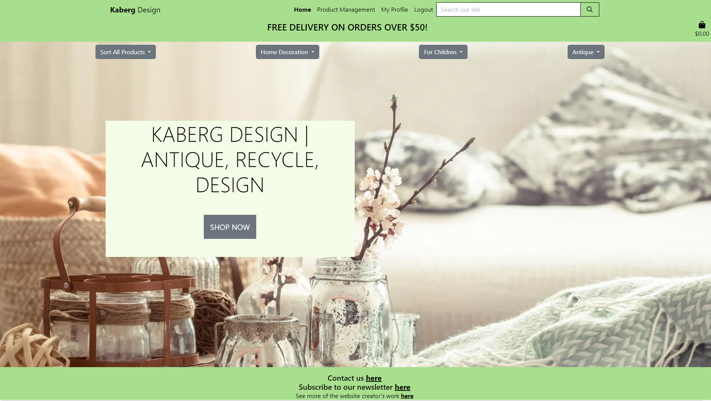
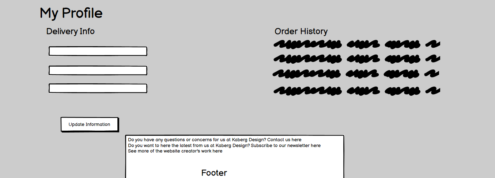
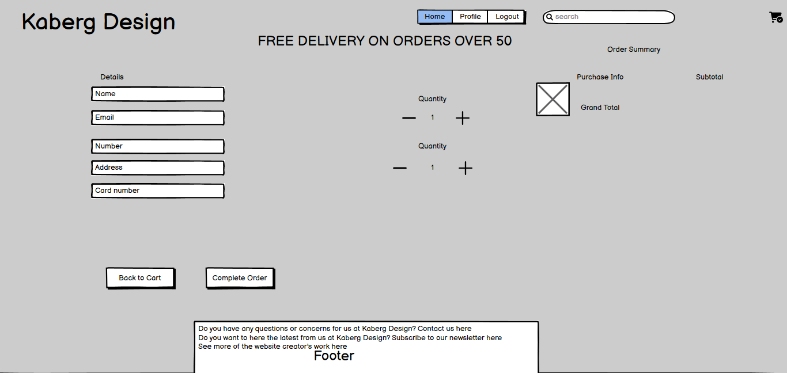

# _Kaberg Design_



---

# Introduction

Kaberg Design is a B2C e-commerce website designed to sell a variety of products to customers. Users can make an account, purchase products, contact the store, and subcribe to the newsletter. The link to the live website is [here](https://kaberg-design-16fc49f93f52.herokuapp.com/).

## Technologies used

- [Python](https://www.python.org/) was one of the main programming languages used to create this project.
- [VScode](https://code.visualstudio.com/) was the editor used to write my code.
- [Javascript](https://www.javascript.com/) was used to make the website more interactive.
- [HTML](https://en.wikipedia.org/wiki/HTML) and [CSS](https://en.wikipedia.org/wiki/CSS) was used to present content to the user on the front end.
- [ChatGPT](https://chat.openai.com/) was used to write product descriptions and the facebook page posts.

---

# Design

## Agile Planning

An agile approach was used to plan and make this project. I made use of GitHub's issues and projects to manage my progress in the project, as well as user stories and epics. A link to my kanban board can be found [here](https://github.com/users/Dekeypetey40/projects/4).


## User stories

| Title | Number | Definition | Completed? | Label |
|-------|--------|------------|------------|-------|
| USER STORY: Account registration | [#1](https://github.com/Dekeypetey40/kaberg-design/issues/1) | As a user, I want to register for an account, so that I can add my information and view my profile. | [x] | Must Have |
| USER STORY: Order confirmation | [#2](https://github.com/Dekeypetey40/kaberg-design/issues/2) | As a user, I want to receive a confirmation after I place my order and pay, so that I know the payment went through and the order was processed. | [ ] | Should Have |
| USER STORY: Password recovery  | [#3](https://github.com/Dekeypetey40/kaberg-design/issues/3) |As a user, I want to be able to recover my password, so that I can get access to my account if I forget my password. | [x] | Should Have |
| Simple login/logout process | [#4](https://github.com/Dekeypetey40/kaberg-design/issues/4) | As a user, I want a simple login and logout process, so that I can easily get access to my account. | [x] | Must Have |
| USER STORY: Navigation bar | [#5](https://github.com/Dekeypetey40/kaberg-design/issues/5) | As a user, I want to an easy to understand navbar, so that I can navigate the site. | [x] | Must Have |
| USER STORY: Social media links | [#6](https://github.com/Dekeypetey40/kaberg-design/issues/6) | As a user, I want clickable social media links, so that I can visit those pages. | [x] | Must Have |
| USER STORY: Add shopping cart items | [#7](https://github.com/Dekeypetey40/kaberg-design/issues/7) | As a user I want to add items to my shopping cart, so that I can purchase them. | [x] | Must Have |
| USER STORY: Review items to purchase in cart | [#8](https://github.com/Dekeypetey40/kaberg-design/issues/8) | As a user, I want to see the items I have added to my cart, so that I can review my purchase. | [x] | Must Have |
| USER STORY: Add quantity in shopping cart | [#9](https://github.com/Dekeypetey40/kaberg-design/issues/9) | As a user, I want to modify the amount of a certain item from my cart, so that I can add or remove items of a certain type from my cart. | [x] | Must Have |
| USER STORY: Secure payments  | [#10](https://github.com/Dekeypetey40/kaberg-design/issues/10) | As a user, I want to to know my card details are safe, so that I am comfortable making payments. | [x] | Must Have |
| USER STORY: Profile payment details | [#11](https://github.com/Dekeypetey40/kaberg-design/issues/11) | As a registered user, I want to save my payment details in my profile, so that I can easily make payments. | [x] | Should Have |
| USER STORY: View total cost | [#12](https://github.com/Dekeypetey40/kaberg-design/issues/12) |  As a user, I want to see the total of my puirchases, so that I can check the total before buying. | [x] | Must Have |
| USER STORY: Sort by category | [#13](https://github.com/Dekeypetey40/kaberg-design/issues/13) | As a user, I want to sort the products by category, so that I can view products from a specific category. | [x] | Must Have |
| USER STORY: Paginated list of products | [#14](https://github.com/Dekeypetey40/kaberg-design/issues/14) | As a user, I want to paginated pages of products, so that I do not have to scroll too much. | [] | Should Have |
| USER STORY: Search bar | [#15](https://github.com/Dekeypetey40/kaberg-design/issues/15) |As a user, I want to search for products with the search bar, so that I can find particular products I am looking for. | [x] | Should Have |
| USER STORY: Contact the store | [#16](https://github.com/Dekeypetey40/kaberg-design/issues/16) | As a user, I want to be able to contact the store, so that I can give them feedback. | [x] | Should Have |
| USER STORY: Updating store products | [#17](https://github.com/Dekeypetey40/kaberg-design/issues/17) | As an admin, I want to edit store products, so that I can change the products in the store. | [x] | Must Have |
| USER STORY: Add new product | [#18](https://github.com/Dekeypetey40/kaberg-design/issues/18) | As an admin, I want to add a product, so that I can have new products appear in my store. | [x] | Must Have |
| USER STORY: Delete a product | [#19](https://github.com/Dekeypetey40/kaberg-design/issues/19) | As an admin/store owner, I want to delete products, so that I can remove products no longer for sale. | [x] | Must Have |
| USER STORY: Search customer model | [#20](https://github.com/Dekeypetey40/kaberg-design/issues/20) | As an admin, I want to search through the customers, so that I can find them all. | [x] | Should Have |
| USER STORY: Contact us email | [#21](https://github.com/Dekeypetey40/kaberg-design/issues/21) | As a store owner, I want to to receive an email when a customer fills out the contact us form, so that can respond to the customer. | [ ] | Should Have |
| EPIC: Smooth purchases for user | [#22](https://github.com/Dekeypetey40/kaberg-design/issues/22) | Purchases should be easy and smooth giving feedback to the user. | [x] | Must Have |
| EPIC: Smooth user interface | [#23](https://github.com/Dekeypetey40/kaberg-design/issues/23) | The interface should be nice to look at and easy to navigate | [x] | Must Have |
| EPIC: Full CRUD functionality for the admin and CRUD elements for users | [#24](https://github.com/Dekeypetey40/kaberg-design/issues/24) | An admin should have full CRUD functionality and users should have it when applicable | [x] | Must Have |
| USER STORY: Account Creation Email Confirmation | [#25](https://github.com/Dekeypetey40/kaberg-design/issues/25) | As an admin, I want to send newly registered users emails to confirm their email, so that I can be sure I contact users at the correct email address. | [x] | Should Have |
| USER STORY: Newsletter subscription | [#26](https://github.com/Dekeypetey40/kaberg-design/issues/26) | As a user, I want to sign up for the store's newsletter, so that I am informed of new deals and information. | [x] | Must Have |
| USER STORY: Unsubscribe to the newsletter | [#27](https://github.com/Dekeypetey40/kaberg-design/issues/27) | As a user, I want to be able to unsubcribe from the newsletter, so that I stop getting emails I do not want. | [ ] | Should Have |
---

## Scope

The goal of this project was to make a functioning e-store. The baseline for this project was to have full CRUD (Create, Read, Update, and Delete) functionality for both admins and users where applicable. One can see this relfected in the user stories and their labels as must have, should have, and could have. At a bare minimum, the aim was to also have a functioning payment system and a subscription form for a newsletter.

## Colour

I decided to stick with a basic colour scheme. I used green to promote the value of recycled and antique products. Otherwise, the intention was to not distract from the product images and instead highlight them. The colour scheme and background image chosen for the homepage where inspired by the color scheme imaged below.


## Flow Chart and Wireframes

Wireframe of the homepage

Wireframe of a blog post







## Entity Relationship


# Features

## Navbar

- Responsive navbar that turns into a burger menu on smaller screens.
- When you have not logged in it shows register and login options and a logout option when logged in.
- When logged in as an admin the product management link becomes available.
- The link that is active is bolded so the user knows where on the webpage they are.


## Homepage


## Reading a blog post

- Here you can see what a blog post looks like when you click read more.
- At the bottom, you can leave a comment, like the post, and read others' comments.


## Tags

- You can see tags on each blog post, which give the user additional information as to what the post is about.
- Users can click on the tags and get a filtered list of blog posts containing that tag.


## Polls

- Here you can look at the list of polls that you can vote on.
- One can only vote once on each poll.
- Once you vote you get to see a piechart with the results of the poll.


## Account creation and logging in and out

- There are messages letting the user know if they have successfully signed in or out.
- If a user wants to logout the site asks them if they are sure.
- Username and password fields are required and prompt the user if they input invalid data.


## Comment CRUD Functionality for Users

- Comments must be approved by an admin. 
- Users have CRUD functionality on the front end.
- If you are the user who made the comment the Edit and Delete buttons appear allowing you to modify the comment.
- If you are not the user who made the comment and try to access the edit or delete urls you will be prevented from updating that comment.


---

# Marketing

- Showing users list of favorited products
- An about page.
- Send email upon purchase

## Facebook

- My facebook page allows people to connect with Kaberg Design.
- The link to my page can be found [here](https://www.facebook.com/profile.php?id=61552848392818)

## Email Marketing

- I have set up the option for clients to sign-up to a newsletter via a form that is linked in the footer of the website.
- This information is stored in a model, which can be found in the admin. 

---

---

# Future Features

- Showing users list of favorited products
- An about page.
- Send email upon purchase

---

# Testing

All testing and validation information can be found [here](TESTING.md).
---

# Deployment

* This site was deployed by completing the following steps:

## Initial Deployment
Below are the steps I took to deploy the site to Heroku and any console commands required

1. To ensure the virtual environment is not tracked by version control, add .venv to the .gitignore file.
1. Install Django with version 3.2:
    * ```pip3 install 'django<4'```
1. Install gunicorn:
    * ```pip3 install gunicorn```
1. Install supporting libraries:
    * ```pip3 install boto3```
    * ```pip3 install django-storages```
    * ```pip3 install psycopg2-binary```
    * ```pip3 install django-phone-field```
    * ```pip3 install django-crispy-forms```
    * ```pip3 install crispy-bootstrap5```
    * ```pip3 install django-countries```
    * ```pip3 install pillow```
    * ```pip3 install django-allauth```
    * ```pip3 install mailchimp```
    * ```pip3 install mailchimp-marketing```
    * ```pip3 install stripe```
    * ```pip3 install pysqlite3-binary```

1. Create requirements.txt:
    * ```pip freeze --local > requirements.txt```
1. Create an empty folder for your project in your chosen location.
1. Create a project in the above folder:
    * ```django-admin startproject <PROJECT_NAME> .``` (in the case of this project, the project name was "Kenpachi")
1. Create an app within the project:
    * ```python manage.py startapp APP_NAME``` (in the case of this project, the app name was "cart", "store", "home", "checkout", "marketing")
1. Add a new app to the list of installed apps in setting.py
1. Migrate changes: 
    * ```python manage.py migrate```
1. Test server works locally: 
    * ```python3 manage.py runserver```  (You should see the default Django success page)
    
## Create Heroku App:
The below works on the assumption that you already have an account with [Heroku](https://id.heroku.com/login) and are already signed in.
1. Create a new Heroku app:
    * Click "New" in the top right-hand corner of the landing page, then click "Create new app."
1. Give the app a unique name:
    * Will form part of the URL
1. Select the nearest location:
    * For me, this was Europe.
1. Add Database to the Heroku app:
    * Navigate to the Resources tab of the app dashboard. Under the heading "Add ons," search for "Heroku Postgres" and click on it when it appears. 
    * Select "Mini - $5.00 USD" from the "plan name" drop-down menu and click "Submit Order Form." (credit card and subscription required)
1. From your editor, go to your projects settings.py file and copy the SECRET_KEY variable. Add this to the same name variable under the Heroku App's config vars.
    * left box under config vars (variable KEY) = SECRET_KEY
    * right box under config vars (variable VALUE) = Value copied from settings.py in project.

### Setting up setting.py File:
1. At the top of your settings.py file, add the following snippet immediately after the other imports:
``` 
import os
import dj_database_url
from django.contrib.messages import constants as messages
if os.path.isfile('env.py'):
    import env
    
SECRET_KEY = os.environ.get("SECRET_KEY")
DEBUG = True
```
1. Delete the value from the setting.py DATABASES section and replace it with the following snippet to link up the Heroku Postgres server:  
   
    ```
    if 'DATABASE_URL' in os.environ:
    DATABASES = {
        'default': dj_database_url.parse(os.environ.get('DATABASE_URL'))
    }
    else:
    DATABASES = {
        'default': {
            'ENGINE': 'django.db.backends.sqlite3',
            'NAME': os.path.join(BASE_DIR, 'db.sqlite3'),
        }
    }
    ```
    
1. Set up AWS S3 in settings.py file and tell Django to use it:
   
   ```
   STATIC_URL = '/static/'
   if DEBUG:
    STATICFILES_DIRS = [
        os.path.join(BASE_DIR, 'static'),
    ]
   else:
    STATIC_ROOT = os.path.join(BASE_DIR, 'static')

   MEDIA_URL = '/media/'
   MEDIA_ROOT = os.path.join(BASE_DIR, 'media')
   
   if 'USE_AWS' in os.environ:
    # Cache control
    AWS_S3_OBJECT_PARAMETERS = {
        'Expires': 'Thu, 31 Dec 2099 20:00:00 GMT',
        'CacheControl': 'max-age=94608000',
    }

    # Bucket Config
    AWS_STORAGE_BUCKET_NAME = 'kaberg-design'
    AWS_S3_REGION_NAME = 'eu-north-1'
    AWS_ACCESS_KEY_ID = os.environ.get('AWS_ACCESS_KEY_ID')
    AWS_SECRET_ACCESS_KEY = os.environ.get('AWS_SECRET_ACCESS_KEY')
    AWS_S3_CUSTOM_DOMAIN = f'{AWS_STORAGE_BUCKET_NAME}.s3.amazonaws.com'

    # Static and media files
    STATICFILES_STORAGE = 'custom_storages.StaticStorage'
    STATICFILES_LOCATION = 'static'
    DEFAULT_FILE_STORAGE = 'custom_storages.MediaStorage'
    MEDIAFILES_LOCATION = 'media'

    # Override static and media URLs in production
    STATIC_URL = f'https://{AWS_S3_CUSTOM_DOMAIN}/{STATICFILES_LOCATION}/'
    MEDIA_URL = f'https://{AWS_S3_CUSTOM_DOMAIN}/{MEDIAFILES_LOCATION}/'
   ```
  
1. Add allowed hosts to settings.py:
    ```
    ALLOWED_HOSTS = [
    'kaberg-design.herokuapp.com',
    'localhost',
    '.localhost',
    ]
    ``` 

1. Create Procfile at the top level of the file structure and insert the following:
    * ``` web: gunicorn PROJECT_NAME.wsgi ```

1. Make an initial commit and push the code to the GitHub Repository.
1. **Run server locally** with ``` python3 manage.py runserver ```


To setup a **virtual env** on **Linux**:
1. Creating a virtual environment: run command ```python3 -m .venv```
2. Activating a virtual environment: run command MacOS ```source .venv/bin/activate```
As long as your virtual environment is activated pip will install packages into that specific environment and you’ll be able to import and use packages in your Python application.

Now that you’re in your virtual environment you can install packages.

1. Install Django:
    * ```pip3 install 'django'```
1. Install gunicorn:
    * ```pip3 install gunicorn```
1. Install supporting libraries:
    * ```pip3 install boto3```
    * ```pip3 install django-storages```
    * ```pip3 install psycopg2-binary```
    * ```pip3 install django-phone-field```
    * ```pip3 install django-crispy-forms```
    * ```pip3 install crispy-bootstrap5```
    * ```pip3 install django-countries```
    * ```pip3 install pillow```
    * ```pip3 install django-allauth```
    * ```pip3 install stripe```
    * ```pip3 install pysqlite3-binary```
1. Run ```pip freeze > requirements.txt```
1. Create a project:
    * ```django-admin startproject <PROJECT_NAME> .```
1. Create an app within the project:
    * ```python manage.py startapp APP_NAME``` (in the case of this project, the app name was "cart", "store", "home", "checkout", "marketing")
1. Add a new app to the list of installed apps in setting.py
1. Migrate changes: 
    * ```python manage.py migrate```
1. Test server works locally: 
    * ```python3 manage.py runserver```
1. Check port 127.0.0.1:8000: (You should see the default Django success page)
2. Follow the steps from above to create the Heroku App and setting un the Settings.py file.

## Database

- The app used ElephantSQL as a free cloud database that uses postgresql.
- One simply makes an account with Elephant SQL, makes a new database and copies the url over to env.py.

---

# Credits

## Python Libraries

- AllAuth
  - This librared allowed for a seamless integration for user accounts and their validation on the site.
- crispy-bootstrap5 and crispy-forms
  - This allowed for easy to use forms that are compatible with bootstrap 5 templates
- Django
  - This framework made it fast and relatively easy to make a full-stack website.
- Bootstrap 5
  - A great css framework to easily style web pages. There is lots of free templates available and they are easy to modify to my needs.
- 

## Content

- A huge thank you to my mentor Aleksei Konovalov for all of his help throughout this process.
- Flaticon and product images were taken from [Freepik](https://www.freepik.com/), [Pexels](https://www.pexels.com/) and [Flaticon](https://www.flaticon.com/)
- Stackoverflow was of huge help at multiple points during the project.
- I was inspired by the [Kenpachi's](https://github.com/GeorgianF/Kenpachi-P5-CI) project. The readme and various elements of the project inspired my own.
- Code Institue's Boutique project inspired my own e-commerce website, which I customized to suit my needs.

---
