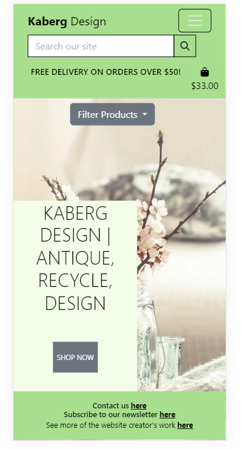
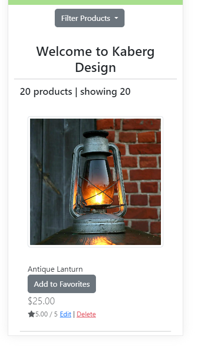
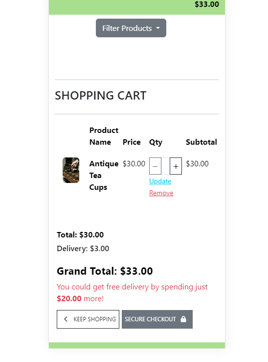
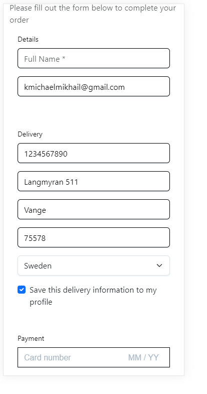

# Testing

## Manual Testing
|     | User Actions           | Expected Results | Y/N | Comments    |
|-------------|------------------------|------------------|------|-------------|
| Sign Up     |                        |                  |      |             |
| 1           | Click on the register button | Redirected to register page | Y |          |
| 2           | Click on Sign Up | User is logged in and receives a message | Y |          |
| 3           | Enter valid email | Field will only accept email address format | Y |          |
| 4           | Enter valid username | Username must be unique | Y |          |
| 5         | Enter valid password | Field will only accept secure passwords | Y |          |
| 6          | Enter valid password confirmation | Field will only accept the same password from the previous field | Y |          |
| 7          | Click the sign in link| Takes user to the sign in page | Y |          |
| Log In      |                        |                  |      |             |
| 1           | Click on Login button in the navbar | Brought to login page | Y |          |
| 2           | Click on the SignUp link in the form | Redirected to the sign up page | Y |          |
| 3           | Enter valid password | Field will only accept correct passwords | Y |          |
| 4           | Click on the Sign In button | Takes user to the index page abd receives confirmation message | Y |          |
| 5           | Click "Logout" in the navbar | Takes user to log out page to confirm logout | Y |          |
| 6           | Click "Logout" button on the page | Redirects user to index page and receive confirmation message | Y |          |
| Navbar     |                        |                  |      |             |
| 1          | Click "Home" in the navbar | Brings user to Home page | Y |          |
| 2          | Click "Product Management" in the navbar | Brings user to page if superuser | Y | Upon adding the product it is added to the database  |
| 3          | Click "Logout" in the navbar | Brings user to loggout page | Y |          |
| 4          | Click "Register" in the navbar | Brings user to sign up page | Y |          |
| 5          | Click "log in" in the navbar | Takes user to log in page | Y |          |
| 6          | Click the logo on the right in the navbar | Takes user to home page | Y |          |
| 7          | Click the "Filter Products by" link and all menu items | Takes user to the products page with the correct products filtered | Y |          |
| 7          | Click the "Home Decoration" link and all menu items | Takes user to the products page with the correct products filtered | Y |          |
| 7          | Click the "For Children" link and all menu items | Takes user to the products page with the correct products filtered | Y |          |
| 7          | Click the "Antique" link and all menu items | Takes user to the products page with the correct products filtered | Y |          |
| 7          | Click the "Contact us" link | Takes user to the contact us page | Y |          |
| Home Page  |                        |                  |      |             |
| 1      | Click on shop now button | Redirects user to the products page | Y |          |
| Products Page  |                        |                  |      |             |
| 1        | Click on product image | Brings user to product detail page | Y |          |
| 2        | Click on the add to favorites button | User receives message saying thank you and favorite added to database | Y |          |
| 4  | Click on the delete button as superuser  | Product is deleted | Y |          |
| 5  | Click on the edit button  | User is redirected to the edit product page | Y |  Upon editing the comment the product is updated        |
| 8  | Visit the delete product url while not signed in as that user  | User is redirected to a page saying you can only modify products if you are an admin them | Y |          |
| 9  | Visit the edit product url while not signed in as that user  | User is redirected to a page saying you can only modify products if you are an admin | Y |          |
| Newsletter  |                        |                  |      |             |
| 1     | Fill in the form and click subcribe | User is informed they subscribed and they are added to the database | Y |          |
| 2    | Click unsubscribe | User is taken to unsubscribe template | Y |          |
| 3    | A user unsubscribes | User's inputted email is removed from the database | Y |          |
| Admin Panel  |                        |                  |      |             |
| 1    | Open admin url while signed in as a regular user | User is informed they are not authorized and is prompted to sign in with a different account  | Y |          |
| 2    | Sign in as the superuser | Redirects user to the admin panel | Y |          |
| 3   | Click on any of the models in the admin panel | User sees a list of the objects with that model | Y |     |
| 4    | Click a specific object within the list of models  | User is shown the properties of that object | Y |  The user may modify, delete, or add objects from this page    |
| 5     | Click delete on an object | User is taken to delete confirmation page and upon confirmation receive a message at the top of the page | Y |   |
| 6     | Approve a user comment | The comment shows as approved and all users can then view that comment | Y |    |
| 7         | Unapprove a user comment | The comment can only be seen by the admin until the comment is approved | Y |          |
| 8       | Edit a post | The content of the post reflects the changes made | Y |          |
| 404 Page  |                        |                  |      |             |
| 9        | Enter an invalid url  | User redirected to a custom 404 error page | Y |          |
| 500 Page  |                        |                  |      |             |
| 10        | Trigger a 500 error | User redirected to a custom 500 error page | Y |          |
| Payments  |                        |                  |      |             |
| 1    | Click secure checkout  | Y | User is taken to checkout page and order summary is shown | Y |          |
| 2    | Fill in information and submit form | Order is processed and user taken to success page | Y |  All form validation functions correctly        |
| 3   | Remove or change contents in the cart | The user can change quantity or remove products as wanted | Y |     |
| 4    | Click a specific object within the list of models  | User is shown the properties of that object | Y |  The user may modify, delete, or add objects from this page    |

---

## Responsive Design

### Homepage and Products

### Checkout

## Validation

### PEP8 Compliant

All python code written by me passes PEP8 standards using the [CI Python Linter](https://pep8ci.herokuapp.com/).

### HTML W3C Validator

All HTML code written by me passed through the [W3C HTML validator](https://validator.w3.org/#validate_by_uri).
- Some minor errors were shown. We had a few trailing and unclosed divs, but after those were fixed there were no issues.

### Jigsaw CSS Validator

All css code passes validation

### Lighthouse Validation

- All fields that functioned were above 90 on all pages when I ran lighthouse.
  - The only outlier was accessibility on the cart page at an 89.
- There was an error with lighthouse where the performance did not show, so I could not see my performance ratings
  - To mitigate the potential performance issues all product images were resized and converted to webpage format.

## Bugs

Bug 1

- Problem: My custom css and images would not load on my website when hosted on heroku.
- Solution: With consultation from my mentor I realized that I had an issue with how I had set up media and static files in relation to my AWS bucket. After fixing these settings it worked properly

Bug 2

- Problem: I could not get MailChimp working properly without throwing errors
- Solution: I instead made my own Subscribed User and contact us models + forms and used django to send me an email when someone uses the contact us form.

Bug 3

- Problem: When a user clicked on the favorites button it added to the database, but the template did not recognize that and therefore show them the remove from favorites button.
- Solution: After hours of googling and troubleshooting with my mentor this was not solved. I tried creating custom tags in my view for my template, and making many different kinds of database requests in my view. I decided that, at a minimum, it was acceptable for the store owner to use that data to inform them as to which products were popular. This functionality will be improved in the future.

Bug 4

- Problem: Filter function was not able to find all products that had a subcategory sharing the same parent category.
- Solution: I adjusted the database requests I was making in my view to in order to query the right data in database in the template.

## Unfixed Bugs

- There are no unsolved bugs.
